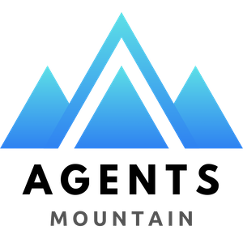
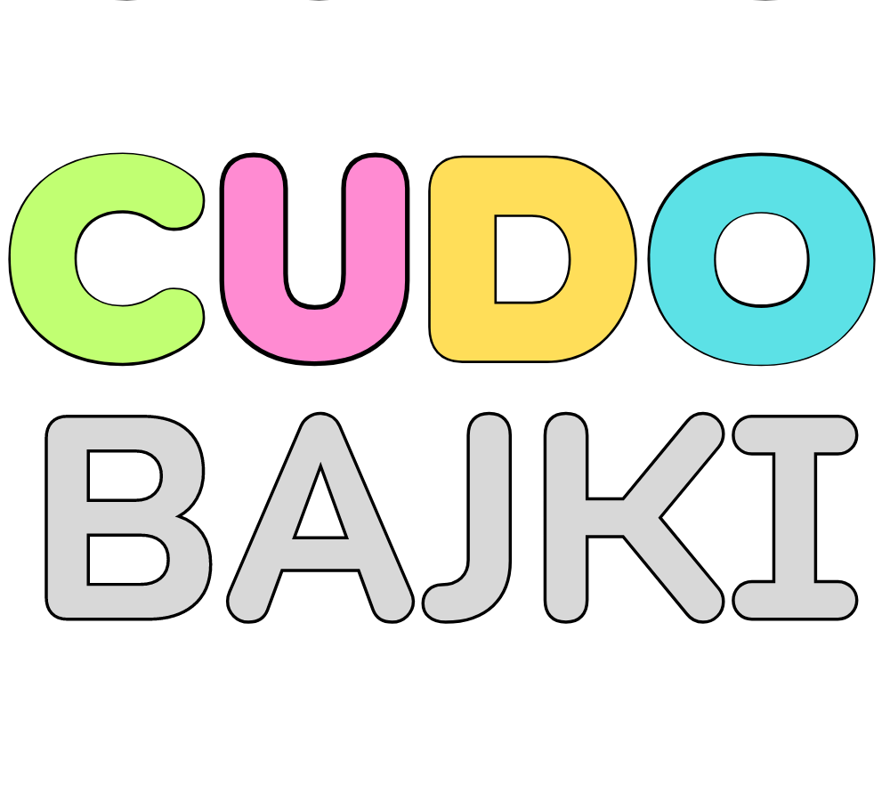

# Hi, I'm Dan

I build AI-powered automation tools and agents that help businesses work smarter.
That's what [Agents Mountain](https://agentsmountain.com) is all about.

PHP developer with 15+ years of experience building scalable backend systems. Lately I've been deep into AI tooling — building CLI tools, MCP integrations, and constantly exploring new AI solutions as they emerge. I like to test what's out there and figure out how to put AI agents to real work.

## Tech Stack

**AI & Automation** &nbsp;

**PHP & Frameworks** &nbsp;

**Languages** &nbsp;

**Tools & Platforms** &nbsp;

## Projects

<table>
  <tr>
    <td width="60" align="center"></td>
    <td><a href="https://tunedocs.com"><b>TuneDocs</b></a> Podcast-style audio overviews generated from documentation</td>
  </tr>
  <tr>
    <td width="60" align="center"></td>
    <td><a href="https://github.com/danmartuszewski/hop"><b>hop</b></a> Fast, elegant SSH connection manager with a TUI dashboard and MCP server</td>
  </tr>
  <tr>
    <td width="60" align="center"></td>
    <td><a href="https://github.com/danmartuszewski/export-key"><b>export-key</b></a> Securely export API keys to your shell - nothing stored, nothing leaked</td>
  </tr>
  <tr>
    <td width="60" align="center"></td>
    <td><a href="https://github.com/danmartuszewski/claude-code-kanban-board-solo"><b>claude-code-kanban-board-solo</b></a> Solo kanban board for managing tasks with Claude Code</td>
  </tr>
  <tr>
    <td width="60" align="center"></td>
    <td><a href="https://github.com/danmartuszewski/mcp-manager"><b>mcp-manager</b></a> Manager for MCP (Model Context Protocol) servers</td>
  </tr>
</table>

## Products

<table>
  <tr>
    <td width="60" align="center"></td>
    <td><a href="https://agentsmountain.com"><b>Agents Mountain</b></a> AI-powered automation service for growing businesses</td>
  </tr>
  <tr>
    <td width="60" align="center"></td>
    <td><a href="https://cudobajki.pl"><b>Cudo Bajki</b></a> Personalized bedtime stories with audio narration for children</td>
  </tr>
  <tr>
    <td width="60" align="center"></td>
    <td><a href="https://dobrastrzelnica.pl"><b>Dobra Strzelnica</b></a> Shooting range finder and booking platform for Poland</td>
  </tr>
</table>
